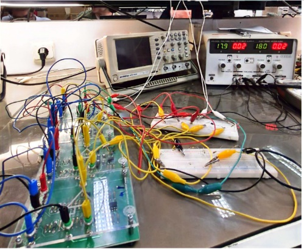
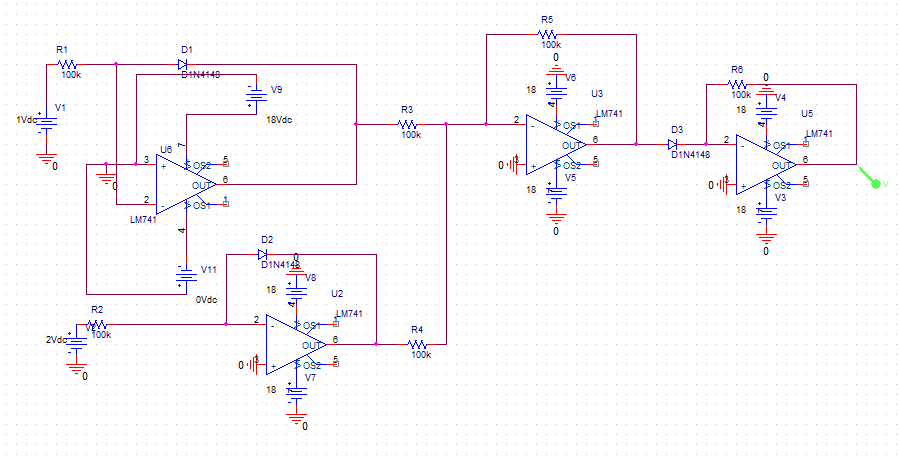
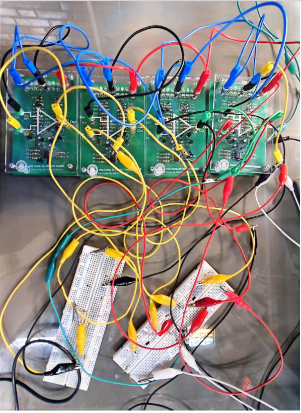

# Analog Multiplier Using Log and Antilog Amplifiers

An analog electronics laboratory project that implements and evaluates a circuit for multiplying two positive DC voltage inputs. The architecture uses four operational amplifiers: two logarithmic stages, one summing stage, and one antilogarithmic stage.

The project includes a laboratory prototype, a simulation schematic image, and nine reported output measurements. The original Persian report provides the construction procedure and circuit analysis.

## Circuit operation

Each logarithmic stage converts an input voltage into a signal related to its logarithm. The summing stage combines the two signals, and the antilogarithmic stage converts the combined signal into an output related to the input product. Resistor ratios and diode characteristics determine the scaling and polarity of the implemented circuit.

The report describes the measured output approximately as

$$
V_{out} \approx k V_1 V_2, \qquad k \approx 0.45\;\mathrm{V}^{-1}.
$$

The coefficient is an empirical approximation for the reported measurements. Its units are inverse volts when all three voltages are expressed in volts.

## Circuit and prototype

The schematic image shows four LM741 operational amplifiers. The report's experimental description and the schematic image contain different component selections:

| Item | Experimental description in the report | Simulation schematic image |
| --- | --- | --- |
| Operational amplifiers | Four amplifiers, hardware model unspecified | Four LM741 amplifiers |
| Diodes | 1N4007 | D1N4148 |
| Logarithmic stage input resistors | 100 kOhm | 100 kOhm |
| Summing stage resistors | 100 kOhm | 100 kOhm |
| Antilogarithmic stage feedback resistor | 200 kOhm | 100 kOhm |

These differences require confirmation before reproducing the experimental circuit or comparing hardware and simulation results. Actual amplifier models, supply settings, and resistor values should be documented for each implementation.

## Reported DC measurements

The final table in the report contains nine measurements. The second input is fixed at 2 V, and the first input ranges from 1 V to 5.1 V. Values below are transcribed from that table and sorted by the first input.

| V1 (V) | V2 (V) | Reported Vout (V) |
| ---: | ---: | ---: |
| 1.0 | 2.0 | 0.908 |
| 1.6 | 2.0 | 1.440 |
| 2.0 | 2.0 | 1.869 |
| 2.5 | 2.0 | 2.300 |
| 3.0 | 2.0 | 2.759 |
| 3.5 | 2.0 | 3.203 |
| 4.0 | 2.0 | 3.536 |
| 4.5 | 2.0 | 4.127 |
| 5.1 | 2.0 | 4.614 |

This plot uses all nine table entries on a numeric input-product axis and compares them with the report's approximate coefficient. Machine-readable values are available in [dc-measurements.json](results/dc-measurements.json).

The measured sweep supports approximate proportionality over the recorded range with V2 held fixed. A two-dimensional input sweep would be needed to evaluate multiplication across different values of both inputs. The report does not specify repeated measurements or measurement uncertainty for this table.

## Reviewing and reproducing the project

1. Read the [original project report](docs/multiplier-report.docx) for the circuit theory, construction procedure, and laboratory photographs.
2. Confirm the experimental component choices in the table above and record the actual supply settings.
3. Test the logarithmic, summing, and antilogarithmic stages separately before connecting the complete circuit.
4. Apply positive DC inputs within the circuit's verified operating range and record the output using a multimeter.
5. Compare the measured output with the input product and extend the measurements to several values of both inputs.

The repository currently contains the simulation schematic as an image. Reproducing the simulation requires the original simulator project, its component models, and the simulator name and version. These can be added in a `simulation/` directory when available.

## Repository contents

| Path | Contents |
| --- | --- |
| `docs/multiplier-report.docx` | Original Persian project report |
| `figures/simulation-schematic.png` | Schematic image extracted from the report |
| `figures/prototype-overview.jpg` | Laboratory setup photograph from the report |
| `figures/prototype-closeup.png` | Prototype wiring photograph from the report |
| `results/dc-measurements.json` | Nine reported DC measurement records with units |
| `results/output-vs-input-product.png` | Plot of the reported measurements and approximate model |

## Project team

- Mohammad Mahdi Shamsaei (محمد مهدی شمسایی)
- مهرسا دخانچی
- سروین موسوی مقدم

Supervisor: Dr. Zarghani (دکتر زرقانی).

## References

1. Project team, [original Persian project report](docs/multiplier-report.docx). Source of the circuit description, schematic image, photographs, and measurement table.
2. Texas Instruments, [LM741 Operational Amplifier datasheet](https://www.ti.com/lit/ds/symlink/lm741.pdf). Component reference for the amplifier shown in the schematic.
3. Vishay, [1N4001 through 1N4007 rectifier datasheet](https://www.vishay.com/docs/88503/1n4001.pdf). Component reference for the diode named in the experimental description.
4. Vishay, [1N4148 diode datasheet](https://www.vishay.com/docs/81857/1n4148.pdf). Component reference for the diode shown in the schematic.
